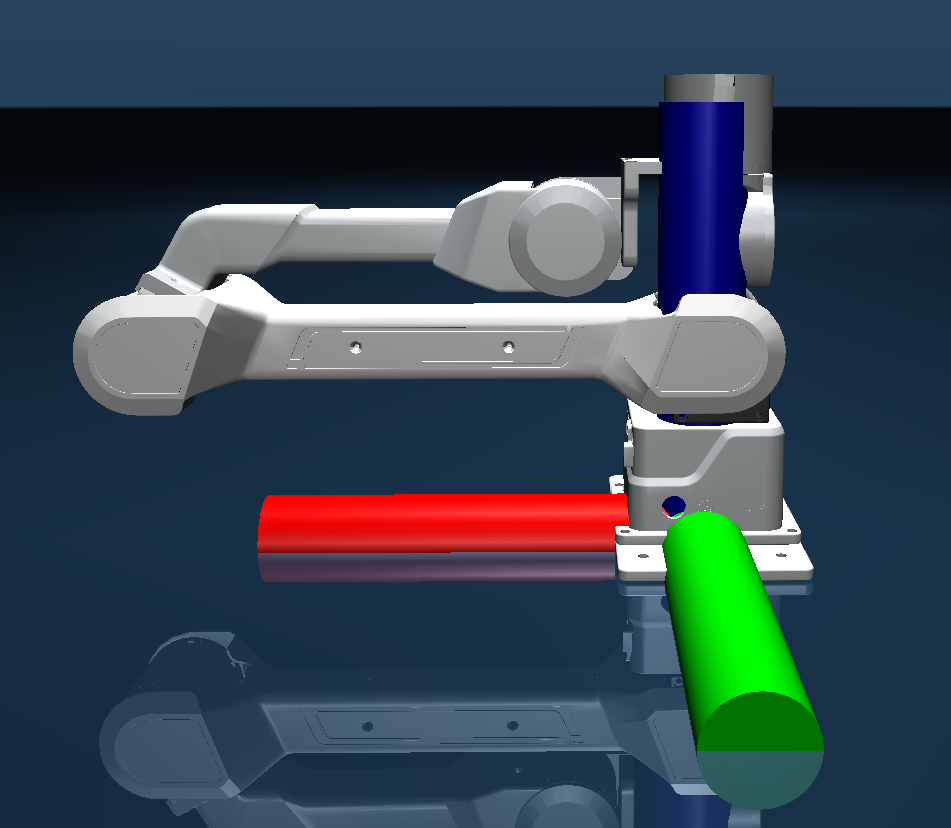

## 1.  简介

S1 机械臂 SDK 提供了控制机械臂运动、读取状态、执行正逆运动学等功能的 Python API。开发者可以使用本 SDK 轻松实现关节控制、末端控制、示教、碰撞检测等功能。

SDK 支持：

* 关节位置/力矩控制

* 末端笛卡尔空间控制

* 正解 / 逆解（KDL Solver）

* 示教记录与回放

* 碰撞检测控制

* 夹爪控制

* 实时状态读取

| 平台 | 平台支持 | 支持版本 |
|----------|----------|----------|
| Linux    | 支持     | Ubuntu 18.04 20.04, 22.04 |
| Windows  | 支持   | Windows 10, 11 |
| macOS    | 暂不支持   | 无 |

推荐平台：  
* ### Ubuntu 22.04

## 2. 安装
### 2.0 环境要求(仅介绍linux环境)
* Python 3.10
* conda 环境管理工具
* cmake>3.10 （用于编译C++扩展）
* pybind11 （用于绑定C++代码到Python）
* c++编译工具链条 （用于编译C++，推荐使用g++）  
#### 2.0.1 安装c++编译工具链条
```bash
sudo apt update
sudo apt install cmake build-essential
```
#### 2.0.2 安装pybind11 
* conda 安装
```bash
conda install -y -n S1 -c conda-forge pybind11
```
* pip 安装
```bash
pip install pybind11
```
### 2.1创建虚拟环境

使用 conda创建Python 3.10 虚拟环境，conda的安装步骤见：

[miniconda安装](https://github.com/YHRG-Robotics/S1_SDK_V2/src/branch/main/doc/conda_install.md)

```plain&#x20;text
conda create -y -n S1 python=3.10
```

然后激活环境，每次使用SDK时都需要这么做

```plain&#x20;text
conda activate S1
```
### 2.2 克隆仓库

在激活了环境之后，下载SDK源码

```plain&#x20;text
git clone https://github.com/YHRG-Robotics/S1_SDK_V2.git
cd S1_SDK_V2
```

### 2.3安装项目及依赖

在源码的S1\_SDK目录下执行：

```plain&#x20;text
./build.sh 
```
### 2.4 运动学坐标系说明

运动学坐标系为基坐标系，具体如图所示，红色为X轴正方向，绿色为Y轴正方向，蓝色为Z轴正方向。



## 3. SDK结构说明

```plain&#x20;text
.
├── build.sh
├── CMakeLists.txt
├── doc ---------------------------------------------------# 文档目录
├── examples-----------------------------------------------# 示例代码/例程
│   ├── python---------------------------------------------# python示例代码/例程
│   │   ├── check_arm.py-----------------------------------# 检查机械臂是否连接
│   │   ├── collision.py-----------------------------------# 碰撞检测示例代码/例程
│   │   ├── disable.py-------------------------------------# 禁用碰撞检测示例代码/例程
│   │   ├── enable.py--------------------------------------# 启用碰撞检测示例代码/例程
│   │   ├── gravity.py-------------------------------------# 重力控制示教示例代码/例程
│   │   ├── keyborad_end_effect.py-------------------------# 键盘控制末端执行器示例代码/例程
│   │   ├── keyborad_joint.py------------------------------# 键盘控制关节示例代码/例程
│   │   ├── read_pos.py------------------------------------# 读取关节位置示例代码/例程
│   │   ├── set_zero_position_gripper.py-------------------# 设置夹爪零位示例代码/例程
│   │   ├── set_zero_position.py---------------------------# 设置零位示例代码/例程
│   │   ├── set_zero_position_teach_gripper.py-------------# 设置示教夹爪零位示例代码/例程
│   │   ├── teaching.py------------------------------------# 示教示例代码/例程
│   │   ├── teleop_demo.py---------------------------------# 遥操作示例代码/例程
│   │   └── test.py----------------------------------------# 测试示例代码/例程
│   └── C++------------------------------------------------# 编译完成后生成的C++可执行文件
├── images-------------------------------------------------# 图片目录
├── include------------------------------------------------# C++扩展头文件目录
│   └── S1_SDK.hpp
├── lib----------------------------------------------------# C++扩展库目录
├── pyproject.toml-----------------------------------------# python项目配置文件
├── readme.md----------------------------------------------# 项目说明文档
└── src----------------------------------------------------# 项目源文件目录
    ├── S1_interface.cpp-----------------------------------# pybind文件
    ├── S1_SDK
    │   ├── arm_mode---------------------------------------# 控制模式目录
    │   │   ├── base_mode.py-------------------------------# 基础控制模式
    │   │   ├── __init__.py--------------------------------# 初始化文件
    │   │   ├── only_real.py-------------------------------# 仅实机控制模式
    │   │   ├── only_sim.py--------------------------------# 仅模拟机控制模式
    │   │   └── real_control_sim.py------------------------# 实机与模拟机控制模式
    │   ├── hardware---------------------------------------# 硬件接口目录
    │   │   ├── collision.py-------------------------------# 碰撞检测接口
    │   │   ├── __init__.py
    │   │   ├── motor_interface.pyi------------------------# 扩展说明文件
    │   │   └── mujoco_sim.py------------------------------# mujoco接口
    │   ├── __init__.py
    │   ├── resource---------------------------------------# 资源目录
    │   │   └── meshes-------------------------------------# 3D模型目录
    │   └── S1_arm.py
    └── S1_SDK_C++ ----------------------------------------# C++源文件目录
        ├── control_pos_vel.cpp----------------------------# 位置速度控制示例代码/例程
        ├── disable.cpp------------------------------------# 禁用碰撞检测示例代码/例程
        ├── enable.cpp-------------------------------------# 启用碰撞检测示例代码/例程
        ├── graivty.cpp------------------------------------# 重力控制示例代码/例程
        ├── read_pos.cpp-----------------------------------# 读取关节位置示例代码/例程
        ├── set_end_zero_pos.cpp---------------------------# 设置末端执行器零位示例代码/例程
        └── set_zero_pos.cpp-------------------------------# 设置零位示例代码/例程
```

### examples文件夹：
包含机械臂各个功能使用示例
## 参数说明  
--dev 设备端口号(linux一般为/dev/ttyUSBx,windows一般为COMx)  
--mode 控制模式（only\_real,only\_sim）  
--end 末端执行器类型(None,gripper,teach)  
检查机械臂是否连接并检测当前已连接机械臂的端口  
注意：串口权限问题，linux更改权限，windows下需要安装对应的驱动（ch340）
```plain&#x20;text
sudo chmod 777 /dev/ttyUSB0
```
检测当前电脑是否连接了机械臂，并显示已连接的机械臂端口
```plain&#x20;text
python3 check_arm.py
```
自碰撞检测示例
```plain&#x20;text
python3 collision.py  --dev /dev/ttyUSB0
```
失能示例
```plain&#x20;text
python3 disable.py  --dev /dev/ttyUSB0
```
使能示例
```plain&#x20;text
python3 enable.py  --dev /dev/ttyUSB0
```
重力补偿示例
```plain&#x20;text
python3 gravity.py  --dev /dev/ttyUSB0
```
键盘控制末端位姿示例
```plain&#x20;text
python3 keyborad_end_effect.py  --dev /dev/ttyUSB0
```
键盘控制关节角度示例
```plain&#x20;text
python3 keyborad_joint.py  --dev /dev/ttyUSB0
```
读取机械臂当前位置示例
```plain&#x20;text
python3 read_pos.py  --dev /dev/ttyUSB0
```
遥操作示例
```plain&#x20;text
python3 teleop_demo.py  --master_dev /dev/ttyUSB0 --slaver_dev /dev/ttyUSB1  
```

* hardware文件夹

包含电机驱动，各功能的具体实现

* src文件夹

提供给用户的具体接口  


## 4. 快速开始
```
机械臂接入电脑时是串口设备如/dev/ttyUSB0 /dev/ttyUSB1等
```
### 4.1 初始化机械臂  
使用前需给串口权限，否则会报错：

```plain&#x20;text
sudo chmod 777 /dev/ttyUSB0
```

使用前需要导入机械臂的接口，因为在上面安装时已经安装到本地，所以可以在任意项目需要的地方使用：

```plain&#x20;text
from S1_SDK import S1_arm,control_mode
```

此时导入了机械臂SDK的读取与控制接口，控制模式，再实例化机械臂：

```plain&#x20;text
S1 = S1_arm(control_mode.only_real,dev="/dev/ttyUSB0",end_effector="None",check_collision=True)
```

此时可以初始化机械臂

参数说明：

1.control\_mode(SDK模式)：是否选择调用实体机械臂

2.dev(机械臂接口)：实体机械臂对应的设备端口号

3.end\_effector(末端执行器)：末端执行器类型，包括：None(无末端)、gripper(夹爪)、teach(示教器)

4.check\_collision(碰撞检测)：是否启用碰撞检测，默认启用

### 4.2 机械臂控制模式

机械臂SDK有多种模式，主要模式包括单独控制真实机械臂的模式，单独控制仿真的模式，仿真和真实机械臂联动模式，真实机械臂控制仿真模式，详情可自行查看S1\_arm.py中的control\_mode

#### 4.2.1仅真实机械臂模式 (only\_real)

指定端口号可对真实机械臂进行控制

#### 4.2.2仅仿真模式(only\_sim)

创建对象之后会出现一个mujoco仿真页面，可通过SDK操控仿真页面里的机械臂，用于上实机之前验证控制是否安全（仅支持角度控制）

#### 4.2.3实机控制仿真模式(real\_control\_sim)

在仿真中会有机械臂的数字孪生，人去拖动现实的机械臂时，仿真页面里的机械臂也会随之移动

## 5. 状态读取


### 5.1 读取角度

```plain&#x20;text
from S1_SDK import S1_arm,control_mode
S1 = S1_arm(control_mode.only_real,dev="/dev/ttyUSB0",end_effector="None")
pos = S1.get_pos()
```

调用get\_pos()方法会返回当前的各个关节角度，单位为弧度值

### 5.2 读取力矩

```plain&#x20;text
from S1_SDK import S1_arm,control_mode
S1 = S1_arm(control_mode.only_real,dev="/dev/ttyUSB0",end_effector="None")
tau = S1.get_tau()
```

调用get\_tau()方法会返回当前电机的各个关节角度的力矩，注：仅有实体电机模式会返回力矩

### 5.3 读取速度

```plain&#x20;text
from S1_SDK import S1_arm,control_mode
S1 = S1_arm(control_mode.only_real,dev="/dev/ttyUSB0",end_effector="None")
vel = S1.get_vel()
```

调用get\_vel()方法会返回当前电机的各个关节角度的速度，注：仅有实体电机模式会返回速度

### 5.4 读取电机温度

```plain&#x20;text
from S1_SDK import S1_arm,control_mode
S1 = S1_arm(control_mode.only_real,dev="/dev/ttyUSB0",end_effector="None")
temp_mos,temp_rot = S1.get_temp()
```

调用get\_temp()方法会返回当前电机的各个关节角度的 温度，注：仅有实体电机模式会返回温度

## 6. 机械臂控制

### 6.1 速度位置模式

使用为：

joint\_control(pos)

pos为位置列表，对应各个关节的角度

```plain&#x20;text
from S1_SDK import S1_arm,control_mode
S1 = S1_arm(control_mode.only_real,dev="/dev/ttyUSB0",end_effector="None")
pos = [0.0] * 6
S1.joint_control(pos)
```

### 6.2 MIT控制

该控制响应速度较高，使用时注意安全

joint\_control\_mit(pos)

pos为位置列表，对应各个关节的角度

```plain&#x20;text
from S1_SDK import S1_arm,control_mode
S1 = S1_arm(control_mode.only_real,dev="/dev/ttyUSB0",end_effector="None")
pos = [0.0] * 6
S1.joint_control_mit(pos)
```
### 6.3 末端执行器控制

使用为：  
control_gripper(pos,foc)  
pos为位置，对应末端执行器的位置  
foc为力矩，对应末端执行器的力矩

```plain&#x20;text
from S1_SDK import S1_arm,control_mode
S1 = S1_arm(control_mode.only_real,dev="/dev/ttyUSB0",end_effector="gripper")
pos = 1.0 #range:0~2.0位置控制
foc = 0.5 #力矩控制
S1.control_gripper(pos,foc)
```
## 7. 机械臂功能

### 7.1 使能与失能

```plain&#x20;text
S1.enable() #使能
S1.disable() #失能
```

注意:使能后才能进行运动控制，失能会使机械臂失去力矩，使用时注意安全。

### 7.2 设置零位

```plain&#x20;text
S1.set_zero_position() #机械臂整体设置零位
S1.set_zero_position_gripper() #单独夹爪设置零位
```

注意：机械臂本体上有明确的零位位置，设置零位时需准确与本体上的零位对应，切勿在其他非零点位置设置零位，避免控制时发生危险。

若夹爪拆卸后重新安装，此时易混淆末端法兰的位置，建议重新设置零位。

### 7.3 关节角度控制

```plain&#x20;text
pos = [0,0,0,0,0,0]
S1.joint_control(pos)
```

此时直接传入机械臂的角度，机械臂运动到对应位置，注意方向。

### 7.4 机械臂末端控制
使用正逆解接口之前，需初始化求解器，初始化时需传入末端执行器的偏移量，单位为米。
```
from S1_SDK import S1_arm,control_mode
S1 = S1_arm(control_mode.only_real,end_effector="None")
S1.slover = S1_slover([0.0, 0.0, 0.0])
```
#
```plain&#x20;text
# 以下为四元数接口
end_pos_quat = [0, 0, 0.3, 0.0, 0.0, 0.0, 1.0]
pos = S1.inverse_quat(end_pos_quat)
# 以下为欧拉角接口
end_pos_euler = [0, 0, 0.3, 0.0, 0.0, 0.0]
pos = solver.inverse_eular(end_pos_euler)
```

四元数接口的顺序为x, y, z, qx, qy, qz, qw

欧拉角顺序的接口为x, y, z, r, p, y

注意：

运动学坐标系为基坐标系，具体如图所示，红色为X轴正方向，绿色为Y轴正方向，蓝色为Z轴正方向。

由于逆解的无解和多解特征，在保证末端位姿下，其余各关节可能解算到突变的位姿，使用时需远离设备，避免发生危险。


### 7.5 运动学正逆解

```plain&#x20;text
# 正解
pos = [0, 0, 0, 0, 0, 0]
pose_quat = solver.forward_quat(pos)

pose_euler = solver.forward_eular(pos)

# 逆解
pos_quat = solver.inverse_quat(pose_quat)

pos_euler = solver.inverse_eular(pose_euler)

```

注意区分四元数接口与欧拉角接口，接口顺序同上6.3节。

### 7.6 重力补偿

```plain&#x20;text
S1.gravity()
```

注意机械臂需要平稳放置于桌面上，否则易发生危险。

机械臂底座有开启重力补偿按钮，可以脱离上位机运行。

### 7.7 机械臂示教

```plain&#x20;text
机械臂SDK目录下的examples文件夹下含有示例：
python3 teaching.py
```

注意：该示例为带参数启动为记录模式，执行命令后添加任意参数，如 python3 teaching.py 1

不带参数启动为复现模式，示例： python3 teaching.py

机械臂底座上有轨迹记录与复现按钮，功能可脱离上位机运行。

### 7.8 夹爪控制

```plain&#x20;text
gripper_pos = 0.0
gripper_tau = 0.5
control_gipper(gripper_pos,gripper_tau)
```

夹爪的单独控制，使用时正常实例化带夹爪的对象，其他关节控制传机械臂六轴参数，

该夹爪函数为单独传参数控制，第一个参数为位置，第二个参数为最大力矩。


## 8 常见问题（FAQ）

待更新  


